# Icon Voting Dapp Sample
------
In this sample, we will develop voting dapp using icondev blockchain and Morpheuslabs blockchain as service platform to leverage development tasks.

dApp includes 2 parts, smart contract and a web page for user to interactive with it, It's all right in python. dApp will go through following steps:
    1. Create workspace.
    2. Create Icon blockchain Ops network.
    3. Test network and sdk.
    4. Deploy smart contract code using tbears cli.
    5. Interact with smart contract.

## Step 1: Create workspace

Morpheuslabs platform provide great system to create a ready blockchain development with few clicks.

Now, we firstly create a workspace with all thing setup to start develop
1. Register new account in `https://bps.morpheuslabs.io`
2. Goto DashBoard tab click on New Workspace button
3. Select Icon for blockchain network to work with, and application for application type, and then click next
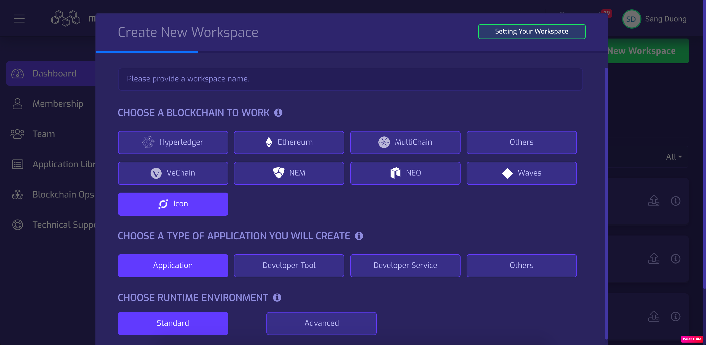

4. Select Icon stack (ML-Icon-One)
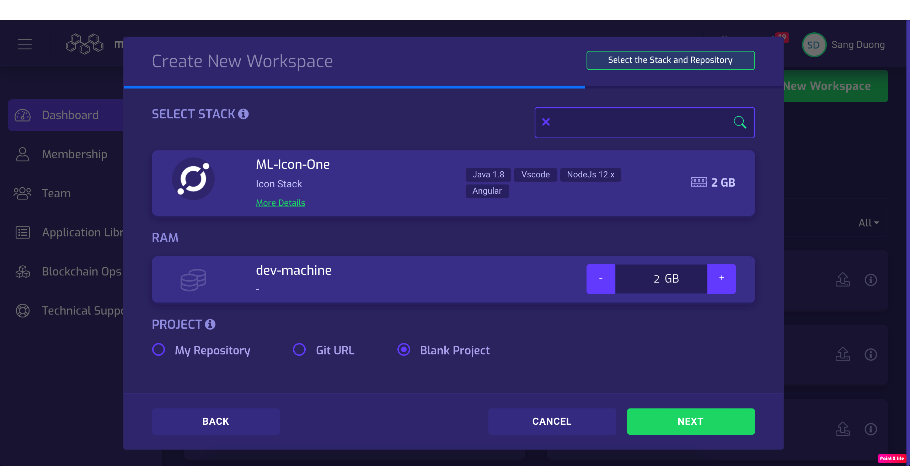
    
5. And then click next, then Confirm & submit to create workspace
6. Start workspace
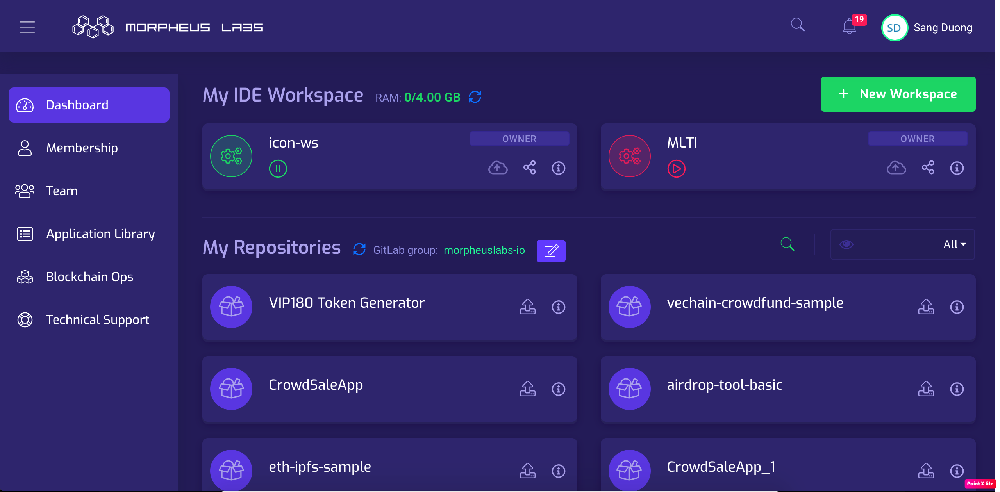
    
7. Open workspace
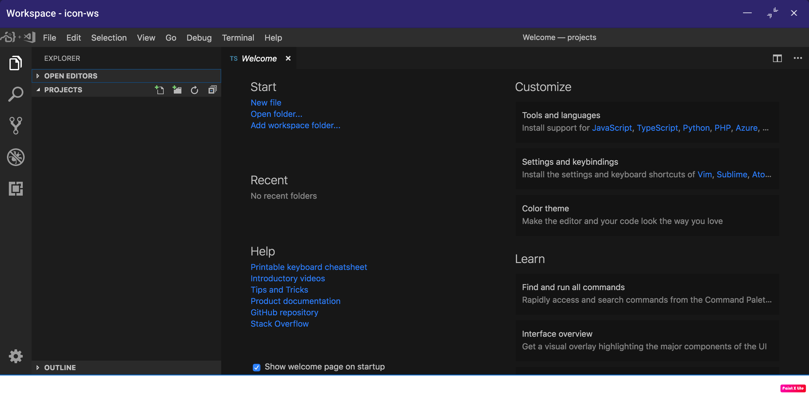
    
So now, we have ready a development env to develop dApp

# Step 2: Create Icon blockchain Ops network

Next, go to Blockchain Ops tab and click New BlockChain button
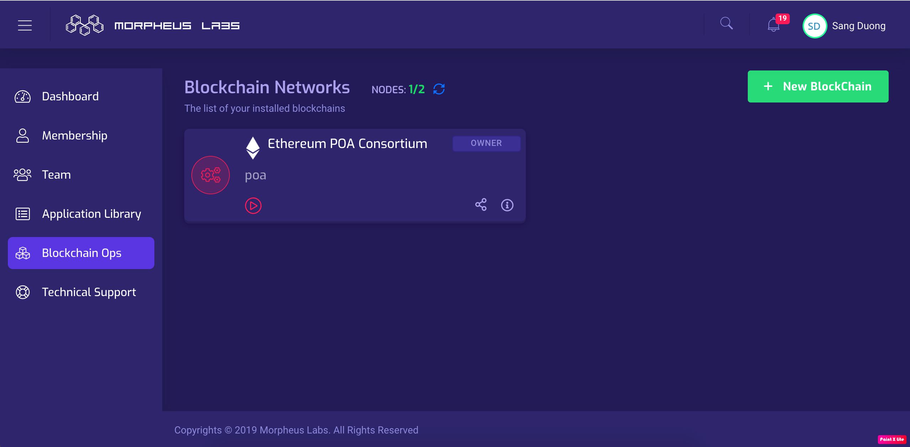

2. Select Icon as your blockchain Ops and enter name
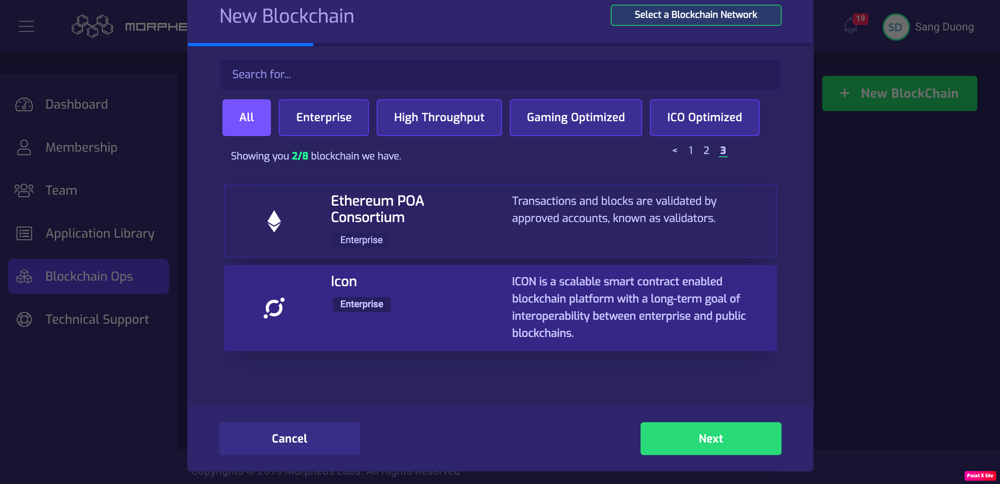

3. Choose Ready to Go for basic setup, or Advance for more customize options, but we select basic setup for now.
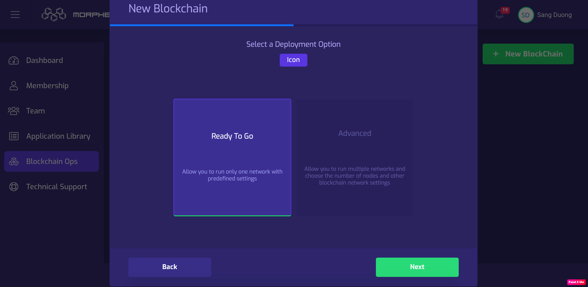

4. Enter prefix as icon and password to create blockchain ops
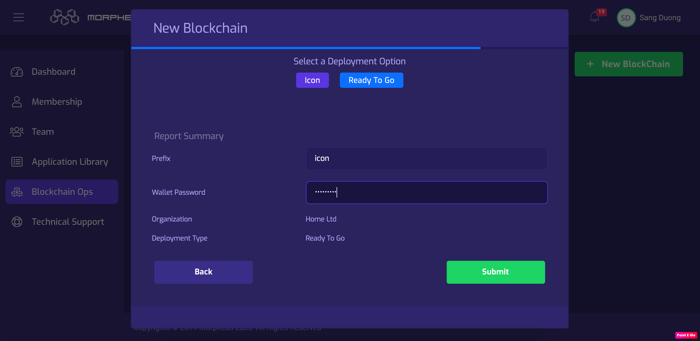

5. Wait a while for creating and click start ico to start node
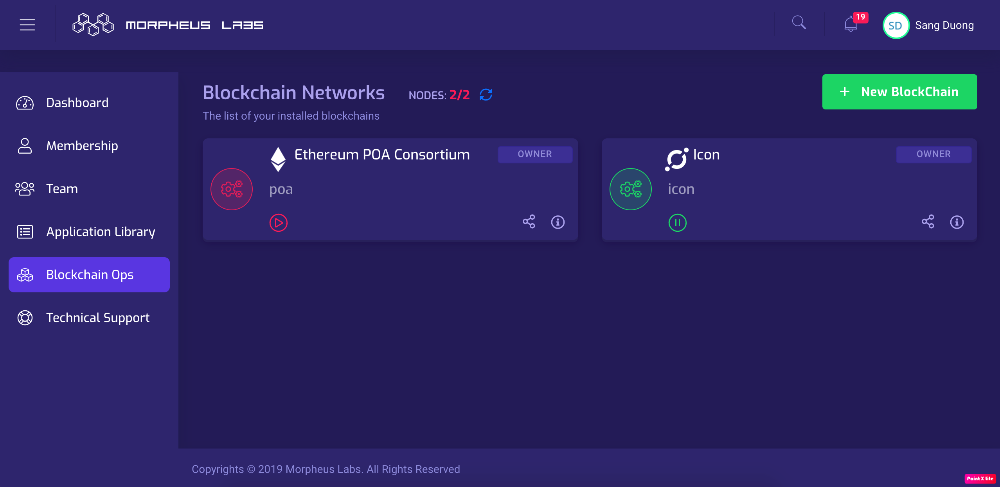

6. To get Internal RPC URL (to connect from workspace), or external RPC URL (to connect from outside), click on information ico (i)
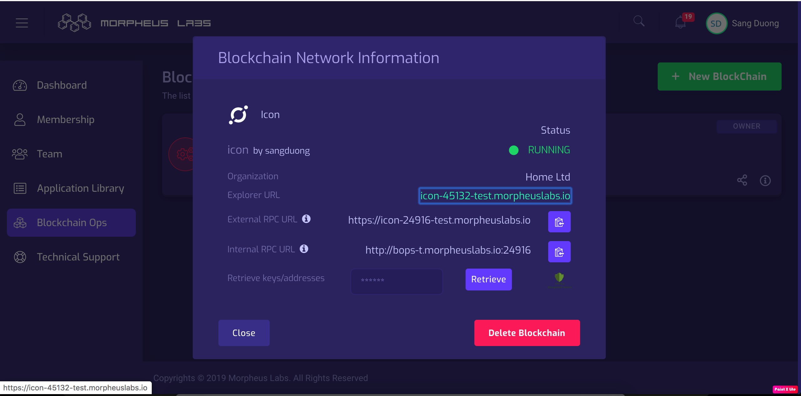

7. Enter your password and click Retrieve button to get genesis address with default icon coin in it.
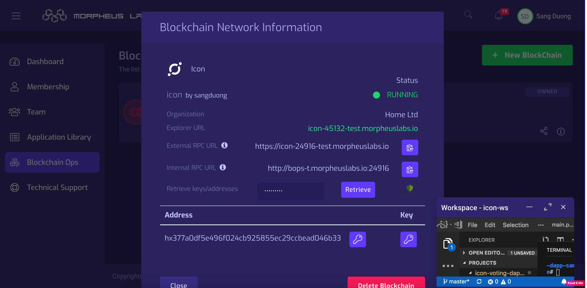


# Step 3: Test network and sdk

Before writing smart contract code, we will create a test script to check development environment and python sdk.

Open workspace and create new test folder with command
`mkdir test`

And then click new code file (let call test.py) with following information

```python
from iconsdk.icon_service import IconService
from iconsdk.providers.http_provider import HTTPProvider

# Creates an IconService instance using the HTTP provider and set a provider.
url = "http://bops-t.morpheuslabs.io:24916" # get url from Internal RPC URL
icon_service = IconService(HTTPProvider(url, 3))

# Gets a block by a given block height.
block = icon_service.get_block('latest')
print(block)

```

Run command `python3 test.py` you should get something like this print out on console `{'version': 'tbears', 'prev_block_hash': '8c49f9a497934bb500050c65bce593af82462ee5e6317face944d76f701c74af', 'merkle_tree_root_hash': 'tbears_block_manager_does_not_support_block_merkle_tree', 'time_stamp': 1571648452705096, 'confirmed_transaction_list': [], 'block_hash': '658594b6a6d249d3e5421d5eec47e71d4ad9055acb3e5d19e3baadca1182562c', 'height': 583, 'peer_id': 'hx6e1dd0d4432620778b54b2bbc21ac3df961adf89', 'signature': 'tbears_block_manager_does_not_support_block_signature'}`

# Step 4: Deploy smart contract code using tbears cli

1. Type `tbears` to see command and supported options

2. Now, let to get application source code from github with `git clone ...`
3. Goto `cd icon-voting-dapp-sample` folder
4. Run command `tbears deploy polling -u http://bops-t.morpheuslabs.io:24916/api/v3`
Result: 
`
root@workspace9gk0hibkceitq4aw:/projects/icon-voting-dapp-sample# tbears deploy polling -u http://bops-t.morpheuslabs.io:24916/api/v3
Send deploy request successfully.
If you want to check SCORE deployed successfully, execute txresult command
transaction hash: 0x5bff45110dbf41fe593746ca86e912d6514f0a38a01c1370e2d6f984544877d6
`
5. Check transaction detail to get contract address
Run `tbears txresult -u http://bops-t.morpheuslabs.io:24916/api/v3 0x5bff45110dbf41fe593746ca86e912d6514f0a38a01c1370e2d6f984544877d6`

Response:
`
Transaction result: {
    "jsonrpc": "2.0",
    "result": {
        "txHash": "0x5bff45110dbf41fe593746ca86e912d6514f0a38a01c1370e2d6f984544877d6",
        "blockHeight": "0x286",
        "blockHash": "0x1cbbb765c2e1ae1a46a6082122e7af363f60eea9935d28f01fd7e907db28bb61",
        "txIndex": "0x0",
        "to": "cx0000000000000000000000000000000000000000",
        "scoreAddress": "cx14b00a5e33ff887cb57e183730e9895ae652fa39",
        "stepUsed": "0x1fa5c20",
        "stepPrice": "0x0",
        "cumulativeStepUsed": "0x1fa5c20",
        "eventLogs": [],
        "logsBloom": "0x00000000000000000000000000000000000000000000000000000000000000000000000000000000000000000000000000000000000000000000000000000000000000000000000000000000000000000000000000000000000000000000000000000000000000000000000000000000000000000000000000000000000000000000000000000000000000000000000000000000000000000000000000000000000000000000000000000000000000000000000000000000000000000000000000000000000000000000000000000000000000000000000000000000000000000000000000000000000000000000000000000000000000000000000000000000",
        "status": "0x1"
    },
    "id": 1
}
`
Copy `"scoreAddress": "cx14b00a5e33ff887cb57e183730e9895ae652fa39"` here is deployed smart contract address (cx14b00a5e33ff887cb57e183730e9895ae652fa39)

That we finished deploy smart contract to network, let move to next part

# Step 5: Interact with smart contract

1. Goto webapp folder, then open main.py file from IDE and update field `default_score` is contract address you just deployed, and update `default_account` with your master address you get from BlockChain Ops.

2. Create 2 more accounts to update to list default whitelist user for voting
Run `cd webapp` and `python3 createwallet.py` 
Result: 
`
address:  hxdacf03b2020ef29d4e0453cef3cc463a290dcccc
private key:  481d4b8492d3064f5637654d9b91a86e3c0d837bb732e1e7a71a17217b2186e7
`
Get this private key and upate into wallets of main.py file
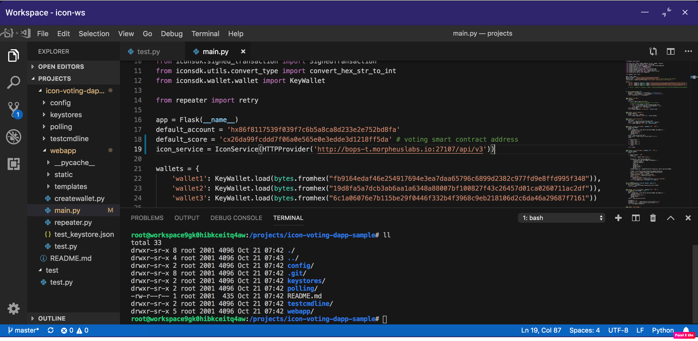

3. Install dependencies
Run `pip3 install flask`

4. Run webapp
`python3 main.py`

5. Open workspace information to get public URL server
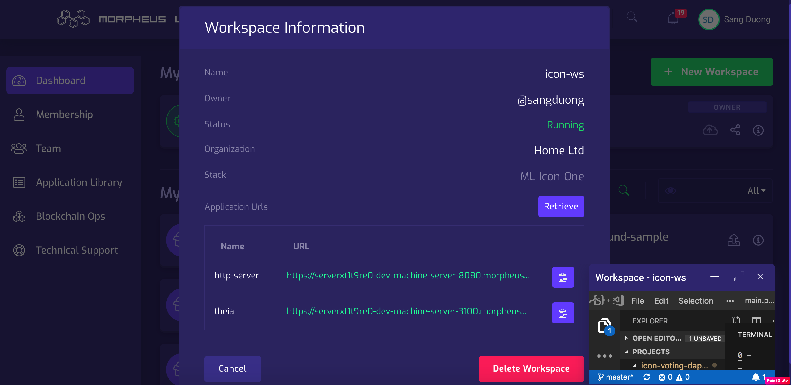

6. Click on http-server link to view dapp
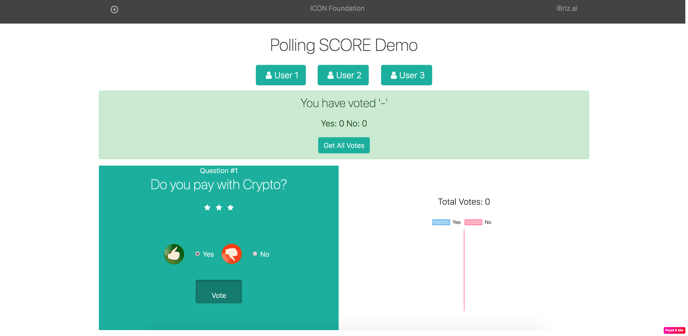

7. Select user you want to use to vote, select option (yes/no) to vote.
Wait for a while for your transaction is confirmed. And you can see your voting on your chart.
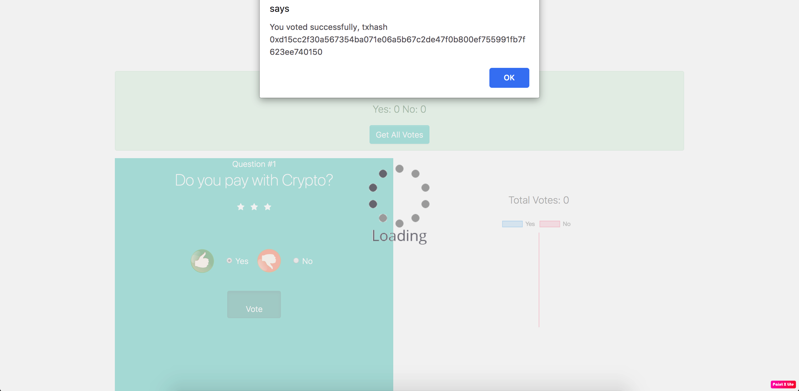
